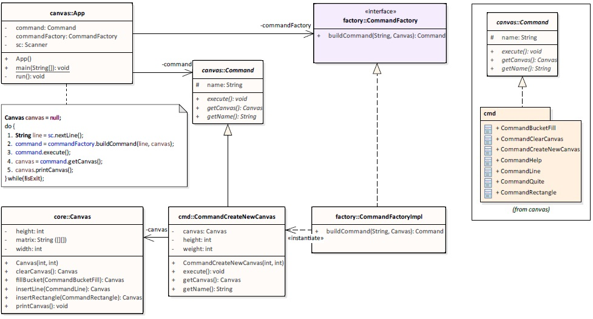

# 🎨 Console Drawing Program

A simple Java-based console drawing application that allows users to create a canvas and draw lines, rectangles, and fill areas—similar to basic functionality found in tools like MS Paint.

---

## 🧠 Problem Statement

You're tasked with creating a console-based drawing app that allows:
- Creating a canvas
- Drawing horizontal/vertical lines
- Drawing rectangles
- Bucket-filling an area
- Exiting the application

---

## 🛠️ Features

- `C w h`: Create a new canvas of width `w` and height `h`
- `L x1 y1 x2 y2`: Draw a horizontal or vertical line using `'x'`
- `R x1 y1 x2 y2`: Draw a rectangle using `'x'`
- `B x y c`: Fill area connected to `(x, y)` with character `c`
- `Q`: Quit the application

---

## 💡 Design Overview

### Project Structure

| Layer        | Responsibility                           |
|--------------|-------------------------------------------|
| `App.java`   | Main entry point and command dispatcher   |
| `cmd/`       | Contains command implementations          |
| `core/`      | Canvas logic and rendering                |
| `exception/` | Custom exception handling                 |

### Command Pattern

The app uses the **Command Pattern** to encapsulate actions:
- `CommandFactory` parses user input and returns command instances.
- Each command (e.g., `CommandLine`, `CommandRectangle`) implements a shared `Command` interface.

### UML Overview



---

## 🪣 Bucket Fill Algorithm

The bucket fill is a **recursive flood fill**:
1. Check current pixel and color it
2. Recurse to adjacent pixels (left, right, up, down)
3. Exit on border, different color, or already filled

**Complexity**: O(n), where n is the number of connected pixels to fill

---

## ✅ Tests

Used **TDD** to develop the application. Test cases are organized by command:
- `CommandBucketFillTest`
- `CommandLineTest`
- `CommandRectangleTest`
- `UseCaseTest`

Test categories:
- `testHP_*`: Happy paths
- `testCL_*`: Case limits (e.g., edge boundaries)
- `testEX_*`: Exception and failure cases

---

## 🧪 Logging

- Logging handled with **Log4j**
- Output stored in `./logs/canvas.log`
- Keeps console clean for interaction
- Logs include user input and errors

---

## 🚀 Build & Run

The app is built with **Maven**. To compile and package:

```bash
mvn clean install
```

Output artifacts:
- `dist/canvas.jar` – Executable JAR
- `dist/canvas.bat` – Windows batch launcher

To run:

```bash
cd dist
java -jar canvas.jar
```

---

## 📝 Sample Session

```text
enter command: C 20 4
----------------------
|                    |
|                    |
|                    |
|                    |
----------------------

enter command: L 1 2 6 2
|xxxxxx              |

enter command: R 16 1 20 3
|               xxxxx|
|xxxxxx         x   x|
|     x         xxxxx|

enter command: B 10 3 o
|oooooooooooooooxxxxx|
```

---

## 🧠 Design Decisions

- **Command Pattern** allows scalable, testable design
- Avoided external libraries except for logging (Log4j)
- Emphasis on clarity, clean code, and test coverage

---

## 📄 License

This project is licensed under the MIT License.

---

Made with ❤️ for a coding challenge.
